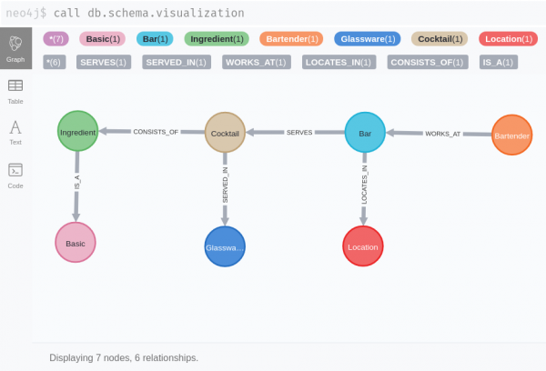

= This Week in Neo4j - AuraDB Free, Spark Connector updates, KNIME Integration and more...
// update slug according to the blog post title, slug must only contain lowercase alphanumeric words separated by dashes, e.g. "this-week-in-neo4j-twitchverse-java-drivers-encryption"
:slug: this-week-in-neo4j-auradb-free-spark-connector-knime-integration
:noheader:
:linkattrs:
:categories: graph-database
:author: Adam Cowley
// twin4j is added automatically; consolidate all tags in each feature to this attribute removing duplicates
:tags:

Hey everyone!

I'm Adam and I work on the education side of our Dev Rel team, namely our link:https://graphacademy.neo4j.com[GraphAcademy^] platform.

I don't know about you, but I always find the week where the clocks fall back in Europe plays havoc with my schedule, especially with the regular meetings arranged by my colleagues over in the US.

For the next month, I will be trawling through the archives to bring you some of the more interesting articles written by our fantastic community members.

We start off with some big announcements from Neo4j related to link:https://neo4j.com/aura[Neo4j Aura] and the Neo4j Connector for Apache Spark.
Tomaz Bratanic also gives us an overview of the new Twitch dataset to Neo4j Sandbox.

We also have posts from Josip Almasi on his Open Source VR Server built on Neo4j, an introduction to the Neo4j Integration for KNIME, and finally Rik Van Bruggen and Stefan Wendin.

I hope you enjoy reading these articles as much as I have.

/Adam Cowley

// introduction

[#featured-community-member,hashtags="neo4j, "]
== Featured Community Member: Dr. Kim Martin, PhD

:tags:

This week's featured community member is Dr. Kim Martin.

featured::images/kim-martin.jpeg[name="Dr Kim Martin"]

// featured community member(s) presentation
Kim is a newcomer to the Neo4j community and in 2020 joined the Department of Forest and Wood Science at Stellenbosch University as a Postdoctoral Fellow.

She has a background in mammalian tissue morphogenesis and a passion for computational modelling of living systems and structures.
Kim is using Neo4j for [TBD].

Kim was the first person to provide us with feedback on our brand new GraphAcademy platform and we are extremely grateful.

Your t-shirt will be making its way to you soon, Kim!

// linkedin link(s)
https://www.linkedin.com/in/kimcmartin[Connect with Kim on LinkedIn, role="medium button"]

[#features-1,hashtags="neo4j, graphacademy, education"]
== The new GraphAcademy

:tags: graphacademy, education

image::https://graphacademy.neo4j.com/img/og/og-landing.jpg[width=150,float="right"]

// 3-4 paragraphs
As this is my first week, I thought I would take this opportunity to shamelessly plug what I have personally been working on for the past few months.
You may have already read link:https://medium.com/neo4j/introducing-the-new-graphacademy-45b0df491a23[my blog post introducing the new GraphAcademy site^], but if not I would like to spend a paragraph or two on our new set of courses.

We have tried to focus on your journey as a Neo4j professional and provide you a clear path to a link:https://graphacademy.neo4j.com/categories/certification/[Neo4j Certification^].

1. The link:https://graphacademy.neo4j.com/courses/neo4j-fundamentals/[Neo4j Fundamentals^] course is designed to give anyone a high-level understanding of what graphs are and where neo4j fits in your tech stack.
2. One you know what graphs are useful for, you can progress to the link:https://graphacademy.neo4j.com/courses/cypher-fundamentals/[Cypher Fundamentals^] course to learn how to get data out of the graph. The course is hands-on, constantly challenging you as you go.
3. The link:https://graphacademy.neo4j.com/courses/modeling-fundamentals/[Graph Data Modeling Fundamentals^] course will then provide you with the techniques required to create and refactor your data model for performance.

The Cypher Fundamentals and Graph Data Modeling Fundamentals courses are both give you some hands-on experience using link:https://sandbox.neo4j.com/[Neo4j Sandbox^] instances.

I hope you enjoy them.  If you have any feedback, Please feel free to reach out by replying to this email or emailing graphacademy@neo4j.com.
Or alternatively, you can use the feedback forms embedded in to every lesson.

https://graphacademy.neo4j.com/[Check out the new GraphAcademy site, role="medium button"]

[#features-2,hashtags="neo4j, AuraDB Free, AuraDB, Cloud]
== Announcing Neo4j AuraDB Free

:tags: Neo4j, AuraDB Free, AuraDB, Cloud

image::https://dist.neo4j.com/wp-content/uploads/20211102110456/DBPRESS1-1.png[width=150,float="right"]

// 3-4 paragraphs
We’re excited to announce that everyone can now use Neo4j AuraDB Free, and get started without a credit card in a number of cloud regions. AuraDB Free is ideal for people who are getting started learning graph, prototyping, and doing early development.

The introduction of AuraDB Free means that you can now sign up and launch a fully-managed Neo4j database free of charge.
Whether you are trying out Neo4j for the first time, working on a prototype application or even looking for a testing environment, this option is for you.

You can start either with an empty database to which you can load your own data or explore the movies dataset.

AuraDB Free databases are free forever, but have a limited graph size of 50k nodes and 175k relationships.
You can get started now without entering credit card details.

https://console.neo4j.io/[Get Started Now for Free!, role="medium button"]

[#features-3,hashtags="neo4j, AuraDB, spark, cloud, connector, Kafka, Spark, streaming"]
== Apache Spark for Neo4j AuraDB

:tags: neo4j, AuraDB, spark, cloud, connector, Kafka, Spark, streaming

image::https://dist.neo4j.com/wp-content/uploads/20211101095904/apache-spark-neo4j-aura-1.jpg[width=150,float="right"]

// 3-4 paragraphs
The new *4.1* release to the link:https://neo4j.com/developer/spark/4.1/[Neo4j Connector for Apache Spark^] provides new functionality that allows you to produce or consume data to and from Neo4j AuraDB.

Bi-direction streaming with Spark will allow users to perform advanced ETL processes, enrich their data sets and even implement Machine Learning workflows with Spark.
The Neo4j Connector for Apache Spark takes advantage of the spark streaming API and treats Neo4j as any other streaming source.

If you are a Neo4j Aura customer, this release is great news. We’ve made bi-directional integration with Spark streaming possible. You can get started today, whether you’re using Aura Free, Professional, or Enterprise. If you are running Neo4j Enterprise Edition, you can do exactly the same.

https://neo4j.com/blog/apache-spark-for-neo4j-auradb/[Read the blog post, role="medium button"]

[#features-4,hashtags="neo4j, "]
== Analysing Twitch streamers and their audiences

:tags:neo4j, twitch, graph data science

image::https://miro.medium.com/max/1400/1*GhPCJNjmBHvFLM-XE-K0aA.png[width=150,float="right"]

// 3-4 paragraphs
Avid fans of https://sandbox.neo4j.com[Neo4j Sandbox^] may have noticed the addition of a new **Twitch** dataset.
This dataset provides a great opportunity to explore the basics of network analysis without having to download and install Neo4j.

After firing up a link:https://sandbox.neo4j.com/?usecase=twitch[new Sandbox instance with the Twitch usecase^], you will be explore the dataset while being introduced to a number of network algorithms from the Graph Data Science library.
The guide will teach you to evaluate overall network statistics, use the PageRank algorithm to determien the most influential streamers, and use Node Similarity algorithms to identify streamers with high crossover in their audiences.

For a more in depth look of the dataset, you can read Tomaz's blog post.

https://medium.com/neo4j/introducing-the-new-twitch-sandbox-bdda36a946bb[Read the Blog Post, role="medium button"]

[#features-5,hashtags="neo4j, open source, vr, virtual reality, WebXR, WebRTC, glTF"]
== Open Source VR Server

:tags: neo4j, open source, vr, virtual reality, WebXR, WebRTC, glTF

// 3-4 paragraphs
This week on the Neo4j Community Site,  link:https://community.neo4j.com/t/open-source-vr-server/46849[Josip Almasi posted a link to his Open Source VR Server^] which has been built on top of Neo4j.
His blog post from December 2020, titled link:https://opensource.com/article/20/12/virtual-reality-server[Why I rewrote my open source virtual reality server^], goes into depth on how he built an open, interoperable VR server to open standards including WebXR and  WebRTC.

https://opensource.com/article/20/12/virtual-reality-server[Action, role="medium button"]

[#features-6,hashtags="neo4j, analytics, data science, etl, knime, cocktails"]
== Neo4j Integration in KNIME

:tags: neo4j, KNIME, etl, cocktails

// 3-4 paragraphs
Artem Ryasik provides information on the link:https://hub.knime.com/redfield/extensions/se.redfield.knime.neo4jextension.feature/latest[Neo4j extension for KNIME Analytics Platform^] that enables you to analyse Neo4j data in KNIME.
The article explores a dataset featuring cocktails, bars and bartenders.
So if you like a tipple, this article could be for you!

KNIME is a free, open-source, data analytics platform that has been designed to provide end-to-end solutions.

https://www.knime.com/blog/neo4j-integration-in-knime[Read the article, role="medium button"]

[#features-7,hashtags="neo4j, neo4j, sales, presentations, graphalue, graph epiphany"]
== Graphalue Part 4: _Presenting_ the case for graph value

:tags: neo4j, sales, presentations, graphalue, graph epiphany

And finally, our friends in Sales and Innovation Rik and Stefan have been at it again, publishing Part 4 in their link:https://www.graphalue.com/[Graphalue^] series, this week presenting some valuable tips on _how_ to present the value case for graphs within your company.

I have spent a lot of time with these two over the years and their I have always found our conversations to be extremely valuable.

I don't know about you, but I'm a huge admirer of Stefan's ability to effortlessly switch between the insightful and the sublime.

// 3-4 paragraphs

https://www.graphalue.com/home/part-4-presenting-the-case-for-graph-value[Listen to Graphalue Part 4 now, role="medium button"]

== Tweet of the Week

There have been so many great tweets this week, Neo4j certainly go link:https://twitter.com/neo4j/status/1454784998180012040[all out for Halloween] and it's great to see link:https://twitter.com/AJarasch/status/1455673320058277895[in-person conferences] are happening again.

But as a Node.js developer with a keen interest in visualisation, I've got to pick https://twitter.com/tb_tomaz[Tomaz Bratanic^]'s tweet, visualising airport thousands of flight routes between airports using link:https://www.sigmajs.org/[sigma.js^].

// replace nnnn with the tweet ID

tweet::1455826347360669699[type={type}]

Don't forget to RT if you liked it too!
